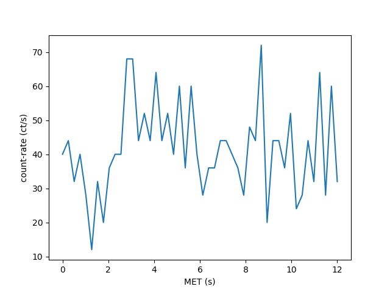

===============
Data Structures
===============

.. _eventlist:

Event list
----------

An ``Eventlist`` represents a list of photon arrival times. This object is a
``ndarray`` subclass with the following added attributes:

+------------+------------------------------------+
| ``tstart`` |  The start time of the observation |
+------------+------------------------------------+
| ``tstop``  |  The stop time of the observation  |
+------------+------------------------------------+
| ``MJD``    |  The observation start time in MJD |
+------------+------------------------------------+

If a ``tstart`` or ``tstop`` time is not explicitly defined, the respective smallest and
largest value in the array of arrival times will be used instead. The ``MJD`` of
an ``Eventlist`` is zero unless explicitly defined. 

Because an ``Eventlist`` is just an ``ndarray`` standard numpy methods can be
used to manipulate the data. Consider the following example where we generate
some random data and proceed to sort the ``Eventlist`` on time::
    
    >>> import numpy as np
    >>> import nicerlab as ni
    >>> data = np.random.uniform(10,20,500)
    >>> evt = ni.Eventlist(data, tstart=10, tstop=20)
    >>> evt = np.sort(evt)
    >>> evt.info()
    Eventlist:
    > counts......: 500
    > exposure....: 10 seconds
    > start/stop..: 10 / 20
    > MJD.........: 0

.. note::
    
   Event list data *should* generally be time ordered, however, this is not a 
   strict requirement for nicerlab. Data contained in an Eventlist object is
   allowed to be out-of-order, and routines operating on an ``Eventlist`` will 
   return the correct ouput either way.

.. _lightcurve:

Light curve
-----------

A `Lightcurve` object is an array of event counts in equidistant time bins. 
This object is a `ndarray` subclass with the following added attributes:

+---------------+--------------------------------------------+
| ``dt``        |  Time bin width in seconds                 |
+---------------+--------------------------------------------+
| ``tstart``    |  The start time of the observation         |
+---------------+--------------------------------------------+
| ``tstop``     |  The stop time of the observation          |
+---------------+--------------------------------------------+
| ``MJD``       |  The observation start time in MJD         |
+---------------+--------------------------------------------+

The bin width will default to 1 if no value is provided. Like for the
``Eventlist``, if the ``tstart`` or ``tstop`` time is not explicitly defined,
the respective smallest and largest value in the array of arrival times will be
used instead. The ``MJD`` of an ``Eventlist`` is zero unless explicitly defined. 

In addition to the extra attributes, the ``Lightcurve`` object also has special
member functions:

+---------------+--------------------------------------------+
| ``timespace`` | Generate an array of times                 |
+---------------+--------------------------------------------+
| ``mjdspace``  | Generate an array of MJD times             |
+---------------+--------------------------------------------+

A ``Lightcurve`` can be constructed manually from any iterable list of counts
as::

    >>> from nicerlab.lightcurve import Lightcurve
    >>> counts = [11, 12, 10, 8, 15, 12]
    >>> lc = Lightcurve(counts, dt=2, tstart=0, mjd=55750)
    >>> lc
    Lightcurve([11, 12, 10, 8, 15, 12])
    >>> lc.timespace()
    array([ 0., 2., 4., 6., 8.])
    >>> np.sum(lc.reshape(-1,2), axis=1)
    Lightcurve([23, 18, 27])

.. warning::
   
   The ``Lightcurve`` constructor will *not* check if the combination
   dt/tstart/tstop are self consistent. The array-size/bin-width always
   take precedence in determining the time axis of the light curve.

An example::

    >>> import numpy as np
    >>> import nicerlab as ni
    >>> import matplotlib.pyplot as plt
    >>> data = np.sort(np.random.uniform(0,12,500))
    >>> evt = ni.Eventlist(data, tstart=0, tstop=12)
    >>> lc = ni.make_light_curve(evt, dt=0.25) / 0.25
    >>> plt.plot(lc.timespace(), lc);
    >>> plt.xlabel('MET (s)');
    >>> plt.ylabel('count-rate (ct/s)');
    >>> plt.show()

.. _powerspectrum:

Power density spectrum
----------------------

A `Powerspectrum` object is an array of powers densities. Note that the
object does not care about what normalization is used. By default the
`make_power_spectrum()` will use the Leahy normalization. 
The following attributes have been added to the object

+---------------+--------------------------------------------+
| ``df``        | Frequency bin width in Hertz               |
+---------------+--------------------------------------------+
| ``tstart``    | The start time of the observation          |
+---------------+--------------------------------------------+
| ``tstop``     | The stop time of the observation           |
+---------------+--------------------------------------------+
| ``MJD``       | The observation start time in MJD          |
+---------------+--------------------------------------------+
| ``stack``     | The number of FFT segments in the spectrum |
+---------------+--------------------------------------------+

Additionally it has a special member function

+---------------+--------------------------------------------+
| ``freqspace`` | Generate an array of frequencies           |
+---------------+--------------------------------------------+

.. _pispectrum:

Spectrum
--------

A spectrum is an PI spectrum object. 

..  _colordiagram:

.. Color diagram
.. -------------

.. A color diagram is slightly different, but quite useful.

